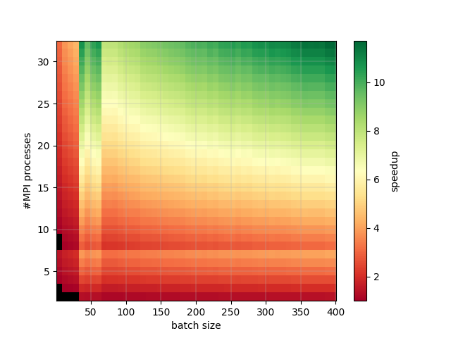

# horovod-speedup-estimator

Python tool to estimate speedup of Pytorch models distributed with Horovod, with respect to the batch size and the
number of MPI processes used.

This is visualized in a 2D plot:



To explain the figure:

- The black areas are configurations where no speedup is achieved (speedup < 1) from distribution, so distributing the
  training of this example network with a batch size less than 40 and with 2 MPI processes will result in slower
  training times compared to training with the same batch size without any distribution of the computation, because of
  communication overhead introduced from distribution.
- 2 - 7 MPI processes can be executed on a single computation node for this case, therefore we see a drop in speedup as
  we have to use mode than one node from 8 MPI processes onwards, as the communication overhead now includes (relatively
  slow) inter-node communication.
- As the batch size increases, the computational work per batch increases, and since the communication time does not
  scale with the batch size (only with the number of parameters in the network), the distribution is more efficient, as
  is reflected by the higher speedup towards the right side of the figure.
- In this example, around a batch size of 50 the results suddenly show a discontinuity in the speedup, this is due to
  external factors that may influence the estimation of computation times (such as cache hits/misses, or other processes
  using the system). Increasing the number of iterations (-it) will result in a reduction of these anomalies and a
  smoother figure, at the cost of longer simulation times.

###Dealing with model hyper parameters

The tool currently only works for models that take no required parameters, 
as they would be impractical to specify on the command line.
Therefore, if you have a model that takes required parameters, you will have to wrap it in a wrapper class.
You can do this as follows:
```python
class MyNet(torch.nn.Module):
    def __init__(self, a, b):  # this nn requires 2 parameters
        self.a = a
        self.b = b
        ...
    ...


class MyNetWrapper(MyNet):  # wrapper behaves exactly like MyNet
    def __init__(self):  # but requires 0 parameters
        a = ...  # you define your parameters here
        b = ...
        super().__init__(a, b)  # and that's it
```
(The model is only initialized once by the tool, keep that in mind when defining model parameters in the wrapper)
You can now use `MyNetWrapper` without issue.